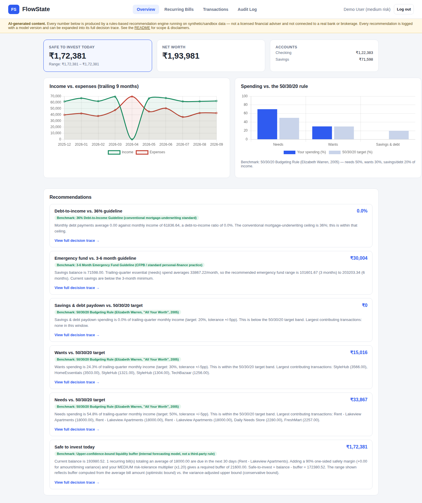
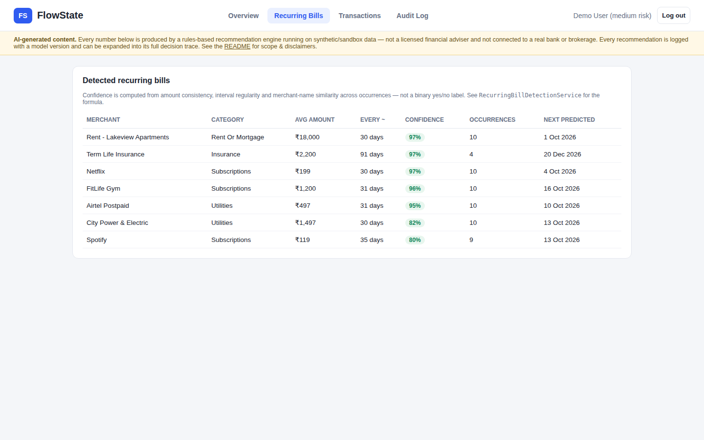
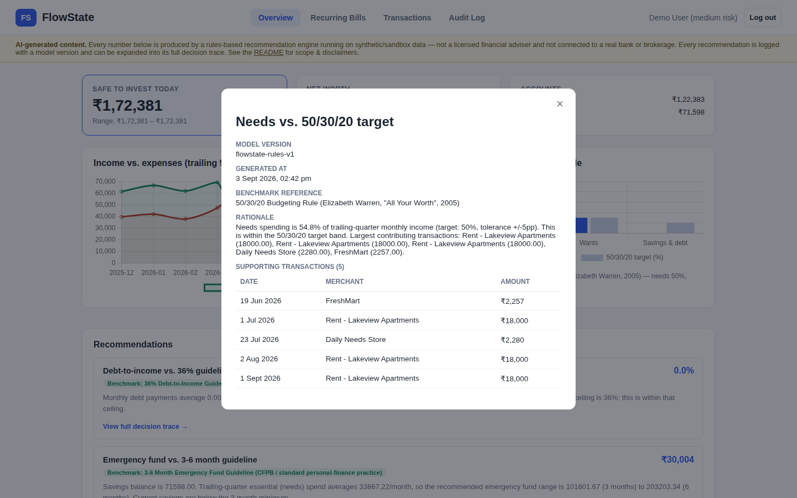
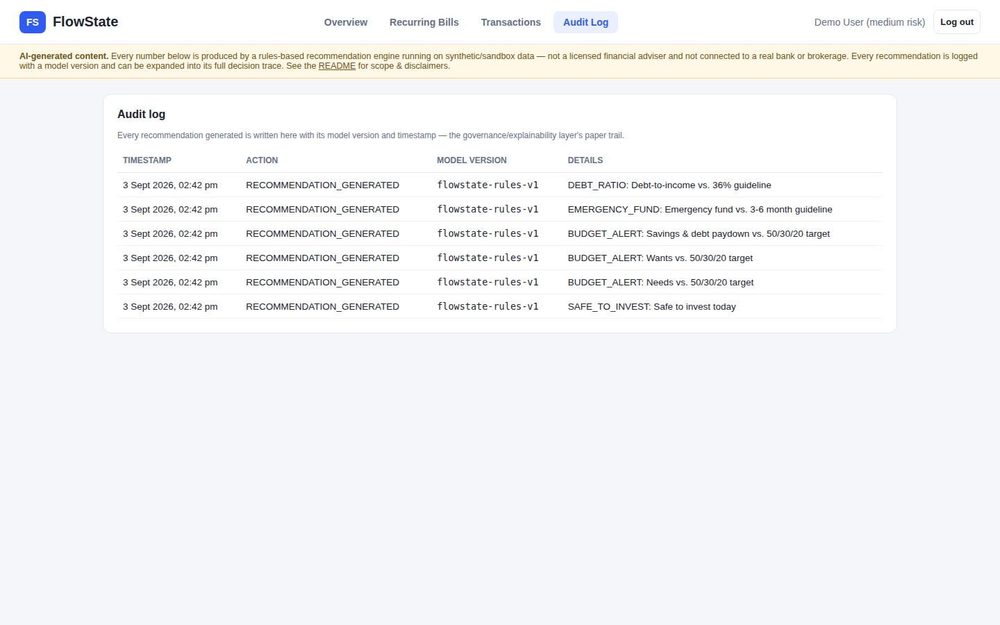
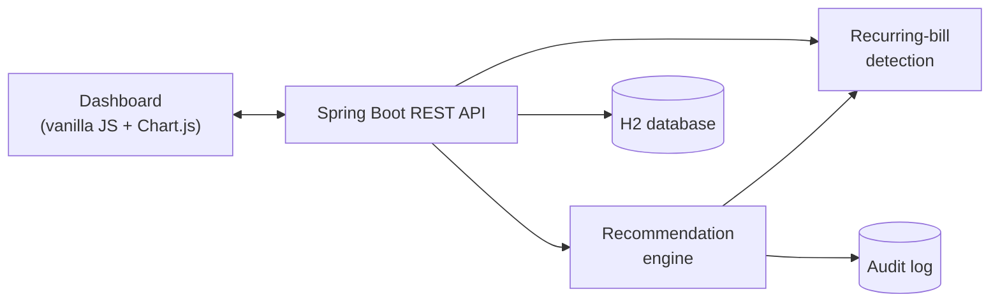

# FlowState

**A personal finance tracking assistant that explains itself.** Track
income, expenses, and recurring bills in one place; get budgeting and
savings recommendations that show their work — the exact transactions,
math, and external benchmark behind every number, not just an opaque
suggestion.

[](https://github.com/jaiswalarisha4-oss/FlowState/actions/workflows/ci.yml)


> Student project. Runs entirely on synthetic data with no real bank or
> brokerage connection — see [Scope & Disclaimers](#scope--disclaimers).



---

## What this is

FlowState is a full-stack Java web app (Spring Boot + a small vanilla-JS
dashboard) built around one idea: a recommendation is only useful if you can
tell *why* it was made. Every number on the dashboard — a "safe to invest"
figure, a budget alert, an emergency-fund check — expands into a full
decision trace: the transactions behind it, the formula, and the specific
external, independently-documented rule it was checked against (the 50/30/20
budgeting rule, the 3-6 month emergency fund guideline, the 36%
debt-to-income ceiling).

It started from a much more ambitious brief — an "agentic wealth co-pilot"
with live bank/brokerage sandbox integrations across a Node/Python/React
stack (see [`docs/project-brief-v2.md`](docs/project-brief-v2.md)). This
repository is a deliberate, from-scratch rebuild in Java, scoped down to
something a solo student can actually build, run with one command, and
defend line-by-line in an interview. What changed and why is documented in
[`docs/ARCHITECTURE.md`](docs/ARCHITECTURE.md#design-decision-why-this-is-a-single-spring-boot-app-not-the-original-multi-service-plan)
— that pivot is itself a useful thing to be able to talk through.

## Quick start

Requires only **Java 17+** — the included Maven wrapper (`./mvnw`) handles
the rest. No database to install, no Node toolchain, no external services —
everything runs from one jar.

```bash
git clone https://github.com/jaiswalarisha4-oss/FlowState.git
cd FlowState
./mvnw spring-boot:run
```

Then open **http://localhost:8080** and either create an account or click
**"Use demo account"** to sign in with 9 months of pre-loaded synthetic
transaction history:

```
email:    demo@flowstate.app
password: flowstate123
```

The first startup seeds that demo account automatically (see
`DemoDataSeeder`) — you'll see it happen in the console log. Data persists
locally in `./data/` (an embedded H2 database file, gitignored) between
restarts.

To run the test suite (including the benchmark validation described below):

```bash
./mvnw test
```

## Features

- **Transaction tracking** across multiple accounts (checking, savings),
  with income/expense categorization.
- **Recurring-bill detection** with a confidence score, not a binary
  yes/no — clusters transactions by amount consistency, interval
  regularity, and fuzzy merchant-name matching. See it live: 23 merchants
  detected and ranked from 92% confidence (rent) down to 19% (one-off
  shopping) in the demo dataset.
  
- **Explainable recommendations** — safe-to-invest surplus, budget checks
  against the 50/30/20 rule, an emergency-fund check, and a debt-to-income
  check — each with a full decision trace you can expand in the UI:
  
- **A governance/audit trail** — every recommendation is logged with the
  model version that produced it, visible in-app:
  
- **Interactive dashboard** — income/expense trend chart, spending vs. the
  50/30/20 target, account balances, all rendered client-side with Chart.js
  (vendored locally — the app has zero external network dependencies at
  runtime).

## Architecture



One JVM process, one Maven module, no build step for the frontend. Full
write-up — request flow, the detection algorithm's scoring formula, the
recommendation engine's four checks, and the design decisions behind
scoping it this way — is in [`docs/ARCHITECTURE.md`](docs/ARCHITECTURE.md).

### Tech stack

| Layer | Choice |
|---|---|
| Language / runtime | Java 17 |
| Framework | Spring Boot 3.3 (Web, Data JPA, Security, Validation) |
| Database | H2 (embedded, file-based) — no external DB to install |
| Auth | Session-cookie auth via Spring Security, BCrypt password hashing |
| Frontend | Vanilla JS + Chart.js (vendored), no build step |
| Testing | JUnit 5, Spring Boot Test |
| CI | GitHub Actions (`.github/workflows/ci.yml`) |

## Tested against proven external benchmarks

Rather than inventing arbitrary thresholds, the recommendation engine's
output is checked directly against well-established, independently-documented
personal-finance rules, and the recurring-bill detector is scored against
both a labeled synthetic dataset and a **real, independently-published
transaction dataset this project didn't create**. Full methodology and
numbers (all real, reproducible by running `./mvnw test` — none of this is a
placeholder) are in **[`docs/BENCHMARKS.md`](docs/BENCHMARKS.md)**. Headline
results from the last run:

| Benchmark | Result |
|---|---|
| Recurring-bill detection precision/recall (labeled synthetic dataset, 25 merchants) | **1.00 / 1.00** |
| Recurring-bill detection on a real external dataset (105 real transactions, no merchant field, only 3 months of history) | **1.00 / 1.00 / 1.00** (precision / recall / accuracy) — got there in two documented rounds, not on the first attempt; see below |
| 50/30/20 budgeting rule — exact-target & overspend scenarios | Engine output matches hand-computed percentages to 1 decimal place |
| 3-6 month emergency-fund guideline | Shortfall/surplus computed exactly against the benchmark range |
| 36% debt-to-income ceiling | Correctly flags scenarios above/below the ceiling |
| Shock scenario (volatile vs. stable bill history) | Confidence interval widens (₹0 → ₹2,462) and the safe-to-invest figure drops (−6.0%) under uncertainty, as it should |

The external-dataset result wasn't always this good, and neither number that
came before is edited out of `docs/BENCHMARKS.md` §2: the first attempt
scored 0.38 accuracy (a linear sample-size penalty crushed real 3-occurrence
bills while letting high-frequency noise through); replacing it with a
proper statistical one-sided 90% upper-confidence-bound on each bill's
variance — the same "never trust a point estimate of uncertainty" principle
already used for the liquidity buffer elsewhere in this app — took that to
0.92, with one false positive left (Gas & Fuel: routine gas fill-ups that
genuinely were as regular, statistically, as a subscription). No amount of
retuning the statistics could separate that case from a real bill without
risking real ones elsewhere, so the actual fix was a signal statistics can't
provide: a category-eligibility check (`Category.isBillEligible()`) that
excludes non-bill categories like groceries, dining, and transport
regardless of how consistent they look. That's what got it to 1.00 across
the board. Full three-round history in `docs/BENCHMARKS.md` §2.

```bash
./mvnw test    # 12 tests, ~6s
```

## Project structure

```
src/main/java/com/flowstate/
├── domain/          # JPA entities (User, Account, Transaction, RecurringBill, Recommendation, AuditLog)
├── repository/       # Spring Data JPA repositories
├── security/          # Session-cookie auth (SecurityConfig, CurrentUserService)
├── service/
│   ├── RecurringBillDetectionService.java   # clustering + confidence scoring
│   ├── RecommendationEngine.java             # the 4 explainable checks
│   ├── SyntheticTransactionGenerator.java    # deterministic demo/test data
│   └── DemoDataSeeder.java                   # seeds the demo account on first run
└── web/               # REST controllers + DTOs

src/main/resources/
├── static/            # index.html, style.css, app.js, vendor/chart.umd.js
└── application.yml

src/test/java/com/flowstate/
├── service/RecurringBillDetectionBenchmarkTest.java   # synthetic labeled dataset
├── service/RealWorldTransactionBenchmarkTest.java      # real external dataset
├── service/RecommendationEngineBenchmarkTest.java
└── util/MerchantNormalizerAndSimilarityTest.java

src/test/resources/external-datasets/
└── personal_transactions.csv   # real, independently-published data (see docs/BENCHMARKS.md §2)

docs/
├── ARCHITECTURE.md    # request flow, algorithm details, design decisions
├── BENCHMARKS.md       # full benchmark methodology + real numbers
├── project-brief-v2.md # the original (larger-scope) project brief
└── screenshots/
```

## API reference

All endpoints under `/api/**` (except `/api/auth/**`) require an
authenticated session cookie.

| Method | Path | Purpose |
|---|---|---|
| `POST` | `/api/auth/register` | Create an account |
| `POST` | `/api/auth/login` | Log in |
| `GET` | `/api/auth/me` | Current user |
| `GET` | `/api/dashboard/summary` | Net worth, trend chart data, category breakdown, headline safe-to-invest figure |
| `GET` | `/api/transactions` | List transactions |
| `POST` | `/api/transactions` | Record a transaction |
| `GET` | `/api/recurring-bills` | Detected recurring bills, ranked by confidence |
| `GET` | `/api/recommendations` | Latest recommendations |
| `POST` | `/api/recommendations/generate` | Re-run the recommendation engine |
| `GET` | `/api/recommendations/{id}/trace` | Full decision trace for one recommendation |
| `GET` | `/api/audit-log` | Governance/audit trail |

## Scope & Disclaimers

This is a student project built on **synthetic data only**:

- **No real bank connection.** All transaction data is either generated by
  `SyntheticTransactionGenerator` (deterministic, seeded) or entered
  manually through the UI. There is no Plaid/Sahamati/open-banking
  integration.
- **No real trade execution, paper or otherwise.** The "safe to invest"
  figure is informational only — there is no brokerage integration.
- **Not financial advice, and not built to any specific regulatory
  framework.** The audit-log / model-versioning / benchmark-reference
  pattern is a demonstration of the *shape* of a governance layer a real
  system would need, not a compliance claim.
- **Auth is simplified for a local/demo deployment.** CSRF protection is
  disabled to keep the plain-`fetch()` frontend simple to run with no build
  step; this is a documented, deliberate trade-off (see `SecurityConfig`),
  not an oversight — a production deployment would re-enable it.

## Interview talking points

A few things this project is specifically designed to let you talk through
in depth, beyond "I built a budgeting app":

- **The recurring-bill confidence formula, and the three bugs that shaped
  it.** First, a raw coefficient-of-variation score let a coffee shop
  visited on random days for random amounts score a misleadingly high
  confidence purely by getting lucky over a 5-transaction sample — fixed
  with a linear "needs more occurrences" penalty. Second, running the
  *fixed* detector against a real external dataset (not one this project
  generated) showed that penalty was itself wrong: 0.38 accuracy, because
  real bills in a short 3-month history never accumulate enough occurrences
  to earn back the confidence the penalty took away, while frequent
  everyday purchases did — replaced with a chi-squared upper-confidence-
  bound on the variance itself, which took accuracy to 0.92. Third, one
  false positive (Gas & Fuel) survived that fix because it genuinely was as
  statistically regular as a subscription — routine fill-ups varying only
  7% in amount, every ~14 days — and no amount of retuning the statistics
  could fix that without risking real bills elsewhere. The actual fix was a
  signal statistics can't provide: a category-eligibility check, since a
  bill is a category of obligation, not just a statistical pattern. That's
  what took it to a clean 1.00 across the board. Being able to walk through
  all three rounds, including the numbers that looked bad before each real
  fix, is a stronger interview answer than a clean story with only one
  draft. Full history in `docs/ARCHITECTURE.md` and `docs/BENCHMARKS.md` §2.
- **Why the safe-to-invest number uses an upper confidence bound, not an
  average.** Recommending the average case would silently mean the "safe"
  amount is wrong roughly half the time. The 1.645σ one-sided bound and the
  risk-tolerance multiplier are both visible, explained numbers on the card
  — try it against the shock-scenario test in `docs/BENCHMARKS.md`.
- **The scope pivot from the original brief.** Cutting the Node/Python
  microservice architecture and live bank/brokerage sandboxes down to a
  single Spring Boot app, and why that's a defensible engineering call
  rather than a shortcut — `docs/ARCHITECTURE.md`.
- **What's a placeholder vs. what's real.** Every number in
  `docs/BENCHMARKS.md` is generated by running the actual test suite, not
  invented for a resume — and the README says so explicitly rather than
  hoping nobody asks.

## Possible future work

- The category-eligibility filter (`docs/BENCHMARKS.md` §2) is currently a
  fixed whitelist of `Category` values. A real product would likely want
  this to be user-correctable ("actually, treat my gym category as a
  bill") rather than hard-coded — the same tension every categorization
  heuristic runs into eventually.
- Real forecasting model (Prophet/ARIMA) behind the same
  `RecommendationEngine` interface, swapping out the closed-form
  upper-confidence-bound calculation.
- A live shock-simulation backtest harness (the original brief's Stage 4)
  replaying many synthetic income-disruption scenarios, rather than the
  current single-scenario test.
- CSV import for real (anonymized) transaction history.
- JWT-based auth with refresh tokens if this ever needed to run
  multi-instance.

## Running the demo end-to-end

1. `./mvnw spring-boot:run`
2. Open `http://localhost:8080`, click **"Use demo account"**, log in.
3. **Overview** tab — see the safe-to-invest figure, income/expense trend,
   and the 50/30/20 comparison chart.
4. Click **"View full decision trace"** on any recommendation card to see
   the exact transactions and formula behind it.
5. **Recurring Bills** tab — see the confidence-ranked list; sort by eye
   from rent (highest confidence) down to one-off shopping (lowest).
6. **Audit Log** tab — every recommendation generation event, with model
   version and timestamp.

## License

MIT — see [`LICENSE`](LICENSE).
