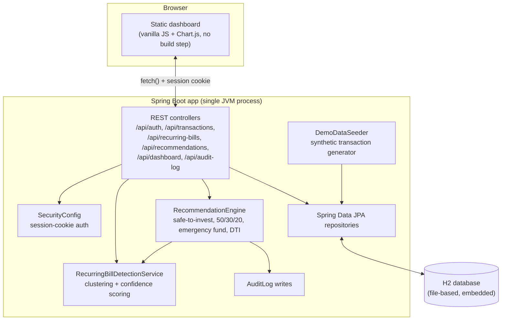

# Architecture

## System overview

Everything runs in one JVM process, one Maven module, one `java -jar`. There
is no separate frontend build, no message queue, no microservices, and no
external bank/brokerage connection — see [Scope & Disclaimers](../README.md#scope--disclaimers)
in the README for why, and the section below for what was cut and why.

## Request flow: from a raw transaction to a recommendation on screen

1. A transaction is created — either by `DemoDataSeeder` on first startup, or
   via `POST /api/transactions` from a real user.
2. `RecommendationEngine.generateRecommendations(user)` is called (on-demand
   via `POST /api/recommendations/generate`, and once automatically after the
   demo seed). It:
   1. Pulls every transaction across the user's accounts.
   2. Runs `RecurringBillDetectionService.detect(...)` to (re)build the set of
      recurring bills, each with a confidence score — not a binary flag.
   3. Computes the safe-to-invest surplus as `balance - upper_confidence_bound(near_term_bills)`.
   4. Checks trailing-quarter spending against the 50/30/20 rule, the 3-6
      month emergency-fund guideline, and the 36% debt-to-income ceiling.
   5. Persists every recommendation with its rationale, benchmark reference,
      and (where applicable) the specific transaction IDs behind it.
   6. Writes one `AuditLog` row per recommendation with the model version
      that produced it.
3. The dashboard calls `GET /api/recommendations` and renders each one as a
   card; clicking "View full decision trace" calls
   `GET /api/recommendations/{id}/trace`, which resolves the supporting
   transaction IDs back into full transaction rows.

Nothing here is a black box: every number on the dashboard can be traced back
to the specific transactions and formula that produced it, in the UI itself,
without reading source code — see `docs/screenshots/04-decision-trace.png`.

## The recurring-bill detection algorithm

See the Javadoc on `RecurringBillDetectionService` for the full formula; in
short:

1. **Filter to bill-eligible categories** — rent/mortgage, utilities,
   insurance, loan payments, subscriptions. Everything else (groceries,
   dining, transport, shopping, ...) is excluded before clustering even
   starts, regardless of how consistent it later turns out to look — see
   round 3 below for the real case that made this necessary.
2. **Cluster** the remaining expense transactions by normalized merchant
   name (case, punctuation, trailing reference numbers, and
   `.com`/`inc`-style suffixes stripped), then fuzzy-merge clusters whose
   keys are Levenshtein-similar (≥ 0.82) so statement-string drift
   ("NETFLIX.COM" vs "Netflix") doesn't split one real bill into two.
3. **Score** each cluster of ≥ 3 transactions on three signals normalized to
   `[0, 1]` — amount consistency, interval regularity, merchant-name
   similarity — combined as a weighted sum. Amount consistency and interval
   regularity are never computed from the raw sample variance: each is a
   one-sided 90% upper-confidence-bound on the true variance (via the
   chi-squared distribution — see `RecurringBillDetectionService`'s
   Javadoc), so a handful of transactions that merely *look* consistent by
   chance gets a properly inflated, more cautious variance estimate, while
   a long, genuinely consistent history doesn't.

This mattered in practice three times, not just in theory — the algorithm's
scoring has been shaped by three rounds of its own benchmark tests catching
real problems, not just passing them:

1. **The first version used a raw coefficient of variation with no
   sample-size awareness at all.** `RecurringBillDetectionBenchmarkTest`
   caught this: a coffee shop visited on random days for random amounts
   scored a misleadingly high confidence purely from getting lucky over a
   5-transaction sample.
2. **The fix for that — a linear `occurrences / 12` penalty on the final
   score — created a new, worse problem, caught by testing against a real
   external dataset.** `RealWorldTransactionBenchmarkTest` runs the same
   detector against a transaction file this project didn't generate. There,
   genuine bills top out at 3 occurrences (the max possible in 3 months of
   real history), so the linear penalty crushed them to 25% of their score,
   while high-frequency noise (16 restaurant visits) kept nearly all of its
   credit — accuracy on that run was a genuinely bad 0.38, reported as-is
   in `docs/BENCHMARKS.md` rather than around. Recomputing the same
   candidates' *uncorrected* consistency scores showed the underlying
   amount/interval signal was fine all along (R-Precision 1.00, the four
   real bills outranked all nine noise categories) — the linear penalty
   itself was the bug, not the heuristic underneath it. Replacing it with
   the chi-squared upper-confidence-bound described above (which degrades
   gracefully with actual statistical reliability instead of an arbitrary
   occurrence count) took accuracy from 0.38 to 0.92 without moving the
   synthetic benchmark off 1.00/1.00.
3. **One false positive remained even after that fix, and it couldn't be
   solved statistically.** Gas & Fuel — routine commute fill-ups — varied
   by only 7% in amount and landed every ~14 days &plusmn;18%: genuinely,
   not coincidentally, as regular as a subscription by the numbers alone.
   No tightening of the amount/interval formula fixes that without also
   risking real biweekly-ish bills elsewhere. What actually fixed it was a
   signal statistics can't provide: `Category.isBillEligible()` restricts
   candidacy to rent/mortgage, utilities, insurance, loan payments, and
   subscriptions, regardless of how consistent a TRANSPORT or GROCERIES
   cluster's statistics look. That took `RealWorldTransactionBenchmarkTest`
   to a clean 1.00 precision / 1.00 recall — see `docs/BENCHMARKS.md` §2 for
   the full three-round history and numbers.

The throughline across all three rounds: every fix came from a benchmark
test finding a *specific, explained* failure — never from lowering a bar
until an assertion passed, and never from hand-tuning a magic number to one
dataset without checking it against the other.

## The recommendation engine's four checks

| Check | What it computes | Benchmark it's validated against |
|---|---|---|
| Safe to invest | `balance - upper_confidence_bound(near_term_recurring_bills) × risk_multiplier` | Internal forecasting model (not a third-party rule — this is FlowState's own contribution) |
| Budget vs. needs/wants/savings | Trailing-quarter spend by category group, as % of income | 50/30/20 Rule (Elizabeth Warren, 2005) |
| Emergency fund | Savings balance vs. 3-6× monthly essential spend | CFPB / standard personal-finance guideline |
| Debt-to-income | Monthly debt payments as % of monthly income | 36% conventional mortgage-underwriting ceiling |

Each is backed by an executable test in `RecommendationEngineBenchmarkTest`
that constructs a scenario with a hand-computed expected percentage and
asserts the engine reproduces it exactly — see `docs/BENCHMARKS.md` for the
actual numbers from the last run.

## Design decision: why this is a single Spring Boot app, not the original multi-service plan

The initial project brief (see `docs/project-brief-v2.md`) sketched an
"agentic wealth co-pilot" architecture: a Node.js API gateway, a Python
forecasting microservice, a Redis/BullMQ queue, Plaid/Alpaca sandbox
integrations, and a SEBI-style compliance layer, aimed at demonstrating
autonomous trade execution gated by governance tooling.

For a solo, from-scratch, Java rebuild, that scope was cut down deliberately:

- **One process, one language.** A Node gateway + Python forecasting service
  + Redis queue is real infrastructure experience, but it's also three
  runtimes to install, configure, and keep in sync for anyone trying to run
  or grade this project. A single Spring Boot app with an embedded H2
  database runs with `mvn spring-boot:run` and nothing else. The tradeoff —
  no independent horizontal scaling of the forecasting step — is irrelevant
  at this project's scale and is an easy, honest thing to name as a known
  limitation in an interview.
- **Rules-based forecasting, not Prophet/LSTM.** The upper-confidence-bound
  buffer calculation (mean + 1.645×σ over near-term recurring bills) is a
  closed-form statistical estimate, not a trained time-series model. It's
  less powerful than Prophet/ARIMA on genuinely seasonal income, but it's
  fully deterministic, testable with exact arithmetic (see
  `docs/BENCHMARKS.md`), and explainable in one sentence on the dashboard —
  which matters more for a project whose whole thesis is explainability.
  Swapping in a real forecasting model behind the same
  `RecommendationEngine` interface is a natural "if I had more time" answer.
- **No live bank or brokerage connection.** Plaid/Alpaca sandbox integration
  is mostly OAuth plumbing and API-key management, not something that
  demonstrates the interesting parts of this project (detection algorithm,
  recommendation logic, explainability). A deterministic synthetic-data
  generator (`SyntheticTransactionGenerator`) gives reproducible demo data
  and a reproducible benchmark dataset instead — see the "why fake data" note
  in the README.
- **Governance layer kept, scaled down.** The audit-log + model-versioning +
  disclosure-banner idea from the brief survived the cut because it's cheap
  to build correctly and is the most defensible interview differentiator per
  the brief's own framing (industry research consistently cites governance,
  not modeling capability, as the actual blocker to shipping automated
  financial advice). What didn't survive: the SEBI-specific regulatory
  language and the pause/kill-switch UI, since claiming compliance with a
  specific real regulatory framework is a bigger claim than a synthetic-data
  student project should make.

This is, itself, the same kind of pivot the original brief made from its own
v1 (autonomous trade execution) to v2 (governance-first) — evaluate what's
actually being demonstrated, cut what's expensive and not load-bearing, keep
what's cheap and differentiated.
